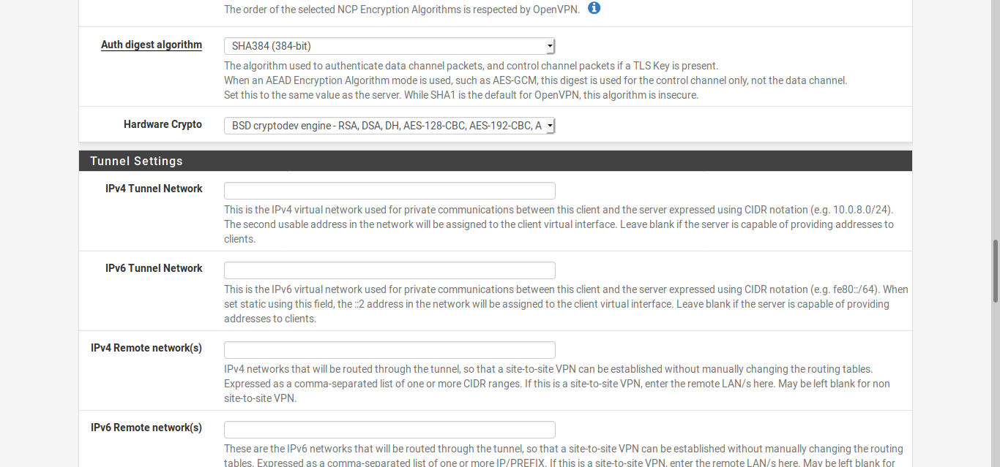

# Complete setup guide: Network segmentation in pfSense with VLANs and VPNs


This guide demonstrates how to build a wired router that segments traffic in VLANs with individual VPN outbound gateways

[Vanilla configuration file](#configuration-files) for the router is attached that you can use as a quickstart to your setup.

## Network Design

pfSense router

* Port 1 (first from left): WAN from DSL modem
* Port 2 (second from left): LAN for main workstation
* Port 3 (third from left): DMZ with managed switch

Managed switch

* Port 1: VLAN 2
* Port 2: VLAN 3
* Port 3-15: VLAN 1
* Port 16: Trunk to Port 3 on router (DMZ)

VLAN 2 holds one webserver fully segmented on network level with clearnet outbound gateway and incoming ports 80 and 443 opened via NAT

VLAN 3 holds one device fully segmented on network level with VPN outbound gateway

VLAN 1 pools unassigned devices in the DMZ and defines one VPN outbound gateway for all of them

## Equipment

The following equipment is tested and recommended:

| Part | Description | Cost
|------|-------------|------
| [apu2e4](https://www.varia-store.com/en/produkt/36842-pc-engines-apu2e4-bundle-board-psu-memory-enclosure.html) | apu2e4 system bundle | $203.27
| [GS116Ev2](https://www.netgear.com/support/product/GS116Ev2.aspx) | Smart Managed Plus Switch | ~$100
| Assorted CAT cables | At least 5 short CAT cables | $10
| [Main workstation you wish to place in LAN](https://ebay.com) | Ex. Lenovo x230 | ~$100
| Devices you wish to place in VLANs | Devices of your choice | Variable

## Update apu2 Firmware

Follow [this section](https://github.com/drduh/PC-Engines-APU-Router-Guide#updating-firmware) of the excellent drduh guide

## Install pfSense on apu2

Follow [this guide](https://github.com/pcengines/apu2-documentation/blob/master/docs/pfSense-install-guide.md)

## Basic router setup

Connect the pfSense router to your DSL modem with Port 1 (first from the left)

After you have completed installation, connect your worstation to Port 2 (second from the left), enter `192.168.1.1` in your browser's address bar.

Enter the default username `admin` and password `pfsense`

Add Primary DNS Server 91.239.100.100 and Secondary DNS Server 89.233.43.71 so you have remote DNS resolution as a fallback to your local unbound DNS resolver


Leave WAN as is

Leave LAN as is


Change admin password

Click `Check for updates`


Go to `System` > `General Setup`

Uncheck
```
Allow DNS server list to be overridden by DHCP/PPP on WAN
```

Click `Save`

Go to `System` > `Advanced` > `Miscellaneous`

```
Cryptographic Hardware: AES-NI and BSD Crypto Device
```

Click `Save`

Go to `Services` > `DNS Resolver`

```
Outgoing Network Interfaces: WAN
```

Click `Save`

This step ensures that the DNS Resolver communicates with authoritative servers over WAN, not a VPN interface.

### DMZ

Go to `Interfaces` > `Interface Assignments`

Select `Available Network Ports: igb2`

Click `Add`


Click on the newly created interface, for example `OPT1`

```
Enable interface
Description: DMZ
IPv4 Configuration Type: Static IPv4
IPv4 Address: 10.0.0.1/24
```


Click `Save`

### DHCP Server

Go to `Services` > `DHCP Server` > `LAN`

```
Range: From 192.168.1.100 To 192.168.1.254 
DNS Servers: 91.239.100.100 & 89.233.43.71
```

This ensures that DNS requests don't go the local unbound DNS resolver so they can be [hijacked](https://mullvad.net/it/help/dns-leaks/) by Mullvad. If Mullvad fails to do this (which they never do), worst case your DNS requests will be forwarded to the excellent [Uncensored DNS](https://blog.uncensoreddns.org) service.


Click `Save`

Go to `Services` > `DHCP Server` > `DMZ`

```
Enable DHCP server on DMZ interface
Range: From 10.0.0.1 To 10.0.0.254
DNS Servers: 91.239.100.100 & 89.233.43.71
```

This ensures that DNS requests don't go the local unbound DNS resolver so they can be [hijacked](https://mullvad.net/it/help/dns-leaks/) by Mullvad. If Mullvad fails to do this (which they never do), worst case your DNS requests will be forwarded to the excellent [Uncensored DNS](https://blog.uncensoreddns.org) service.


Click `Save`

### VPNs

This guide uses [Mullvad VPN](https://mullvad.net) as an example. Any VPN provider that supports OpenVPN will do, and many have pfSense configuration instructions online.

* [ProtonVPN](https://protonvpn.com/support/pfsense-vpn-setup/)
* [IVPN](https://www.ivpn.net/setup/router-pfsense.html)
* [AzireVPN](https://www.azirevpn.com/support/guides/router/pfsense/openvpn)

In a browser open [mullvad.net](https://mullvad.net)

Click on `My Account` and log in with your Mullvad account number

Click on `Download`

Click on `Linux`

Select `Linux` under Platform by using the drop-down menu

Select a Location

Click on `Download` and save it to your computer

Extract the zip file

Go to `System` > `Cert. Manager` > `CAs`

Click `Add`

```
Descriptive name: Mullvad CA
Method: Import and existing Certificate Authority
Certificate data: Copy Certificate data from `mullvad_ca.crt` that was extracted earlier
```


Click `Save`

#### MULLVAD1

Go to `VPN` > `OpenVPN` > `Clients`


Click `Add`

```
Server host or address: se.mullvad.net 
Server Port: 1301
Description: Mullvad Sweden
Username: Your account number
Password: M
TLS Configuration: Unchecked
Peer Certificate Authority: Mullvad CA
Encryption Algorithm: AES-256-GCM
NCP Algorithms: Add AES-256-GCM to the Available NCP Encryption Algorithms
Auth digest algorithm: SHA384
Hardware Crypto: BSD cryptodev engine
Compression: No LZO Compression
Bars the server from adding routes to the client's routing table: Checked
Custom options: remote-cert-tls server
UDP Fast I/O: Checked
Send/Receive Buffer: 1.00 MiB
Gateway creation: IPv4 only
```





Click `Save` 

#### MULLVAD2

Repeat steps from MULLVAD1, replacing

```
Server host or address: de-fra.mullvad.net
Server Port: 1194
Description: Mullvad Frankfurt
```

#### VPN Interfaces

Go to `Interfaces` > `Interface Assignments`

`Available network ports: ovpnc1`

Click `Add`

Click on the newly created interface, for example `OPT2`

```
Enable interface
Description: MULLVAD1
```

Click `Save`

Click `Apply Changes`

Go to `Interfaces` > `Interface Assignments`

`Available network ports: ovpnc2`

Click `Add`

Click on the newly created interface, for example `OPT3`

```
Enable interface
Description: MULLVAD2
```

Click `Save`

Click `Apply Changes`

### Floating

This is a failsafe rule to prevent traffic destined for VPN leaving on WAN

Go to `Firewall` > `Rules` > `Floating`

Click `Add`

```
Action: Block
Interface: WAN
Address Family: IPv4+IPv6
Protocol: Any
Description: Disable Mullvad WAN Egress
Display Advanced > Tagged: MULLVAD_NO_WAN_EGRESS
```

Click `Save`

Click `Apply Changes`

### LAN

Go to `Firewall` > `Rules` > `LAN`

Delete all rules except `Anti-Lockout Rule`


Click `Apply Changes`

Click `Add`

```
Action: Block
Interface: LAN
Address Family: IPv4+IPv6
Protocol: TCP/UDP
Source: Any
Destination: This firewall (self)
Destination Port Range: From DNS(53) to DNS(53)
Description: Block LAN local DNS leak
```


Click `Save`

Click `Add`

```
Action: Block
Interface: LAN
Address Family: IPv6
Protocol: Any
Source: Any
Destination: Any
Description: Drop LAN ipv6 traffic
```


Click `Save`

Click `Add`

```
Action: Pass
Interface: LAN
Address Family: IPv4
Protocol: Any
Source: Any
Destination: Any
Description: Send LAN over MULLVAD2
Display Advanced > Tag: MULLVAD_NO_WAN_EGRESS
Display Advanced > Gateway: MULLVAD2...
```


Click `Save`

Click `Apply Changes`

### DMZ

Go to `Firewall` > `Rules` > `DMZ`

Click `Add`

```
Action: Block
Interface: DMZ
Address Family: IPv4+IPv6
Protocol: TCP/UDP
Source: Any
Destination: This firewall (self)
Destination Port Range: From DNS(53) to DNS(53)
Description: Block DMZ local DNS leak
```

Click `Save`

Click `Add`

```
Action: Block
Interface: DMZ
Address Family: IPv6
Proctol: Any
Source: Any
Destination: Any
Description: Drop DMZ ipv6 traffic
```

Click `Save`

Click `Add`

```
Action: Pass
Interface: DMZ
Address Family: IPv4
Protocol: Any
Source: Any
Destination: Any
Description: Send DMZ over MULLVAD2
Tag: MULLVAD_NO_WAN_EGRESS
Gateway: MULLVAD2...
```

Click `Save`

Click `Apply Changes`

### Outbound NAT

Go to `Firewall` > `NAT` > `Outbound`

Change `Mode` to `Manual Outbound NAT rule generation`

Click `Save`

Click on `Auto created rule - LAN to WAN`

```
Interface: MULLVAD2
Description: LAN to MULLVAD2
```


Click `Save`

Click on `Auto created rule - DMZ to WAN`

```
Interface: MULLVAD2
Description: DMZ to MULLVAD2
```


Click `Save`

Delete `Auto created rule for ISAKMP - LAN to WAN` & `Auto created rule for ISAKMP - DMZ to WAN`

Click `Apply Changes`


## LAN VPN test

Go to `Status` > `OpenVPN`

Make sure both VPNs are running

On your workstation connected to NAT, navigate to [am.i.mullvad.net](https://am.i.mullvad.net) and make sure you're connected without leaks.

## Setup switch

Unplug the GS116Ev2 from power

Unplug the GS116Ev2 from all network connections

Set your workstation to use static IP address of 192.168.0.210, with 255.255.255.0 as the subnet mask

Connect your workstation to one of the switch's ethernet ports

Plug the GS116Ev2 into power

Open your browser and enter `http://192.168.0.239` in the address bar

Login with password `password`

Enable DHCP Mode or enter static IP Address, Subnet Mask, and Gateway Address (recommended) 

`10.0.0.27`, `255.255.255.0`, `10.0.0.1` for example


Click `Apply`

Set your workstation back to DHCP, connect to the pfsense router's LAN port, and enter `10.0.0.27` in your browser's address bar. You should now see the switch web console and be able to login with password `password`

### Change default switch password

Go to `System` > `Maintenance` > `Change Password`


### Update Firmware

Download the newest firmware version from the [netgear website](https://www.netgear.com/support/product/GS116Ev2.aspx#download)

Unpack the .zip, `JGS516PE_GS116Ev2_V2.6.0.43.zip` in this case

Go to `System` > `Maintenance` > `Firmware Update`

Click Browse Files > Newly created folder, `JGS516PE_GS116Ev2_V2.6.0.43` in this case > .bin file, `JGS516PE_GS116Ev2_V2.6.0.43.bin` in this case

Click `Apply` and wait for system to restart


### VLANs

#### Create VLANs on the switch

Go to `VLAN` > `802.1Q` > `Advanced` > `VLAN Configuration`

Set `Advanced 802.1Q VLAN` to `Enable`

When prompted click `OK`

In the `VLAN ID` field, type the ID of the VLAN you wish to create and click `Add`
1. Add VLAN with ID 2
2. Add VLAN with ID 3


#### Add ports to the VLANs

Go to `VLAN` > `802.1Q` > `Advanced` > `VLAN Membership`

In the `VLAN ID` drop down menu, select `VLAN 2`

Port 16 connects to the router and must be marked as tagged in VLAN 2. Click on port 16 until a T appears in the port.

Port 1 connects to the client device and must be marked as untagged in VLAN 2. Click on port 1 until a U appears

Click `Apply`


Repeat the process for VLAN 3 marking Port 2 as untagged and Port 16 as tagged. 

#### Configure port PVID settings for untagged ports

Go to `VLAN` > `802.1Q` > `Advanced` > `Port PVID`

For ports 1 and 2 set the PVID of that port to the VLAN ID of the VLAN it was assigned to. For example, above you added port 1 as an untagged member of VLAN 2. Therefore you set port 1 with a PVID of 2 and click `Apply`.


## Setup VLANs on pfSense router

### VLAN2 Assignment

This step creates the VLAN2 interface

Go to `Interfaces` > `Assignments` > `VLANs`

Click `Add`

```
Parent Interface: igb2
VLAN Tag: 2
VLAN Priority: Leave blank (0)
Description: VLAN2
```


Click `Save`

### VLAN2 Interface Assignment

This step assigns an interface to VLAN2

Go to `Interfaces` > `Assignments` > `Interface Assignments`

Available network ports: VLAN2, Click `Add`

Click on newly created interface, for example `OPT4`

```
Enable interface
Description: VLAN2
IPv4 Configuration Type: Static IPv4
IPv4 Address: 10.0.2.1/24
```


Click `Save`

Click `Apply changes`

### VLAN2 DHCP Server

This step enables the DHCP Server to assign IP addresses on VLAN2

Go to `Services` > `DHCP Server` > `VLAN2`

```
Enable DHCP Server on VLAN2 interface
Range: From 10.0.2.1 to 10.0.2.100
Leave DNS Server 1 and DNS Server 2 blank to use the local unbound DNS resolver
```


Click `Save`

### VLAN2 Outbound NAT

This step sets the outbound traffic rule for devices in VLAN2

Go to `Firewall` > `NAT` > `Outbound`

Click `Add`

```
Interface: WAN
Source: Network 10.0.2.0/24
Description: VLAN2 to WAN
```


Click `Save`

Click `Apply Changes`

### VLAN2 Firewal Rules

This step allows devices in VLAN2 to direct outbound traffic over WAN

Go to `Firewall` > `Rules` > `VLAN2`

Click `Add`

```
Action: Pass
Interface: VLAN2
Address Family: IPv4
Protocol: Any
Source: Any
Destionation: Any
Description: Allow VLAN2 to any rule NO VPN
Display Advanced > Gateway: WAN_DHCP
```

Click `Save`

Click `Apply Changes`

### VLAN2 Inbound NAT

This step passes HTTP and HTTPS traffic to our webserver

Go to `Firewall` > `NAT` > `Port Forward`

Click `Add`

```
Interface: WAN
Protocol: TCP/UDP
Destionation: WAN Address
Destination Port Range: HTTP HTTP
Redirect target IP: 10.0.2.x (replace x with the your webserver's local IP on the ARP table)
Redirect target port: HTTP
Description: HTTP to webserver
Filter rule association: Add associated filter rule
```

Click `Save`

Click `Apply Changes`

Click `Add`

```
Interface: WAN
Protocol: TCP/UDP
Destination: WAN Address
Destination Port Range: HTTPS HTTPS
Redirect target IP: 10.0.2.x (replace x with the your webserver's local IP on the ARP table)
Redirect target port: HTTPS
Description: HTTPS to webserver
Filter rule association: Add associated filter rule 
```
Click `Save`

Click `Apply Changes`

### VLAN3 Assignment

This step creates the VLAN3 interface

Go to `Interfaces` > `Assignments` > `VLANs`

Click `Add`

```
Parent Interface: igb2
VLAN Tag: 3
VLAN Priority: Leave blank (0)
Description VLAN3
```

Click `Save`

### VLAN3 Interface Assignment

This step assigns an interface to VLAN3

Go to `Interfaces` > `Assignments` > `Interface Assignments`

Available network ports: VLAN3, Click `Add`

Click on newly created interface, for example `OPT5`

```
Enable interface
Description: VLAN3
IPv4 Configuration Type: Static IPv4
IPv4 Address: 10.0.3.1/24
```

Click `Save`

Click `Apply Changes`

### VLAN3 DHCP Server

This step enables the DHCP Server to assign IP addresses on VLAN3

Go to `Services` > `DHCP Server` > `VLAN3`

```
Enable DHCP Server on VLAN3 interface
Range: From 10.0.3.1 to 10.0.3.100
DNS server 1: 91.239.100.100 
DNS server 2: 89.233.43.71
```

This step ensures DNS requests don't go the local unbound DNS resolver so they can be hijacked by Mullvad. If Mullvad fails to do this (which they never do), worst case your DNS requests will be forwarded to the excellent [Uncensored DNS](https://blog.uncensoreddns.org) service. 

Click `Save`

### VLAN3 Outbound NAT

This step sets the outbound traffic rule for devices in VLAN3

Go to `Firewall` > `NAT` > `Outbound`

Click `Add`

```
Interface: MULLVAD1
Source: Network 10.0.3.0/24
Description: VLAN3 to MULLVAD1
```

Click `Save`

Click `Apply Changes`

### VLAN3 Firewal Rules

This step prevents devices in VLAN3 to leak IPv6 and DNS and allows devices in VLAN3 to direct outbound traffic over MULLVAD1

Go to `Firewall` > `Rules` > `VLAN3`

Click `Add`

```
Action: Block
Interface: VLAN3
Address Family: IPv4+IPv6
Protocol: TCP/UDP
Source: Any
Destination: This firewall (self)
Destination Port Range: From DNS(53) to DNS(53) 
Description: Block VLAN3 local DNS leak
```


Click `Save`

Click `Add`

```
Action: Block
Interface: VLAN3
Address Family: IPv6
Proctol: Any
Source: Any
Destination: Any
Description: Drop VLAN3 ipv6 traffic
```


Click `Save`

Click `Add`

```
Action: Pass
Interface: VLAN3
Address Family: IPv4
Protocol: Any
Source: Any
Destination: Any
Description: Send VLAN3 over MULLVAD1
Tag: MULLVAD_NO_WAN_EGRESS
Gateway: MULLVAD1...
```

Click `Save`

Click `Apply Changes`

### VLAN3 Inbound NAT

You don't need to pass anything in unless you want to port forward, which is possible with Mullvad. In that case do the same procedure as with the webserver replacing `80/443` with the port of your choice, redirect target IP with `10.0.3.x`, destination with `MULLVAD1 address` and interface with `MULLVAD1`.

Maybe I'll write a guide on this in the future. Message me if I haven't and you need help.

## Testing

Go to [am.i.mullvad.net](https://am.i.mullvad.net) from LAN and wait for results

Go to [am.i.mullvad.net](https://am.i.mullvad.net) from DMZ (switch ports 3-15) and wait for results

Go to [am.i.mullvad.net](https://am.i.mullvad.net) from VLAN3 (switch port 2) and wait for results

Disable MULLVAD1 and MULLVAD2 (`Status` > `VPN`) and ensure you have no internet connectivity from devices in LAN, DMZ, and VLAN3

Restart MULLVAD1 and MULLVAD2

## Configuration Files

[config-pfSense.xml](https://github.com/nixbitcoin/pfSense-guide/raw/master/config-pfSense.xml)	[(.sig)](https://github.com/nixbitcoin/pfSense-guide/raw/master/config-pfSense.xml.sig)
username: `admin`
password: `pfsense`

[My PGP key](https://keys.openpgp.org/vks/v1/by-fingerprint/577A34527F3E2A85E80FE164DD11F9AD5308B3BA)

## Restore vanilla configuration

### pfSense router

If you wish to use the vanila configuration file, boot your pfSense router, connect the pfSense router to your DSL modem with Port 1 (first from the left), connect your worstation to Port 2 (second from the left), enter `192.168.1.1` in your browser's address bar.

Exit out of the pfSense Setup Wizard by clicking on the logo in the top left corner

Go to `Diagnostics` > `Backup and Restore`

Under `Restore Backup` click `Browse...`

Select the `config-pfSense.xml` downloaded above

**Don't forget to verify my PGP signatures**

Change the password in the User Manager.

Now enter your Mullvad Account Number in `VPN` > `OpenVPN` > `Clients` in the field `Username` and you should be good to go

## Resources

* [How to: Proper partial network VPN with "kill switch"](https://www.reddit.com/r/PFSENSE/comments/6edsav/how_to_proper_partial_network_vpn_with_kill_switch/)
* [How to configure VLANs on a ProSAFE Web Managed Plus Switch with shared access to the internet](https://kb.netgear.com/30919/How-to-configure-VLANs-on-a-ProSAFE-Web-Managed-Plus-Switch-with-shared-access-to-the-internet)
* [Using pfSense with Mullvad](https://mullvad.net/en/help/using-pfsense-mullvad/)
